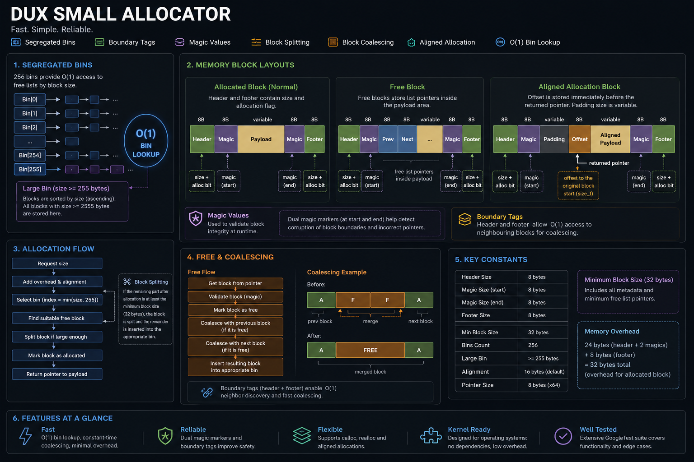
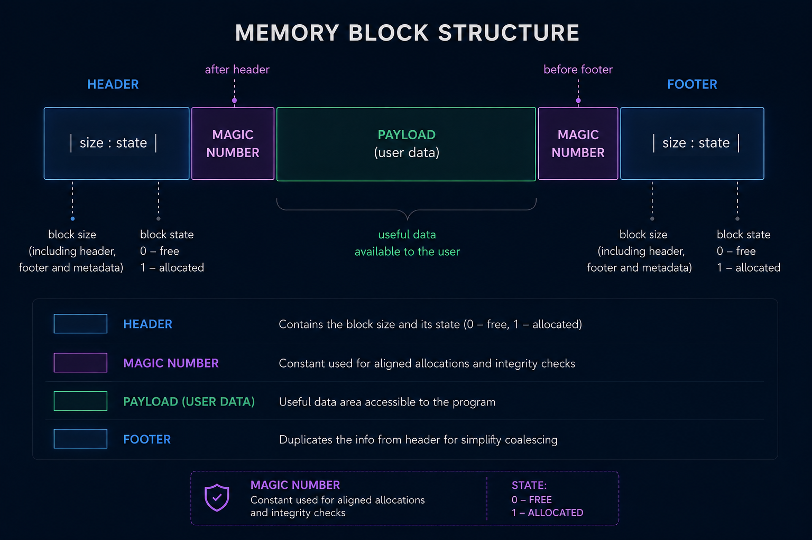
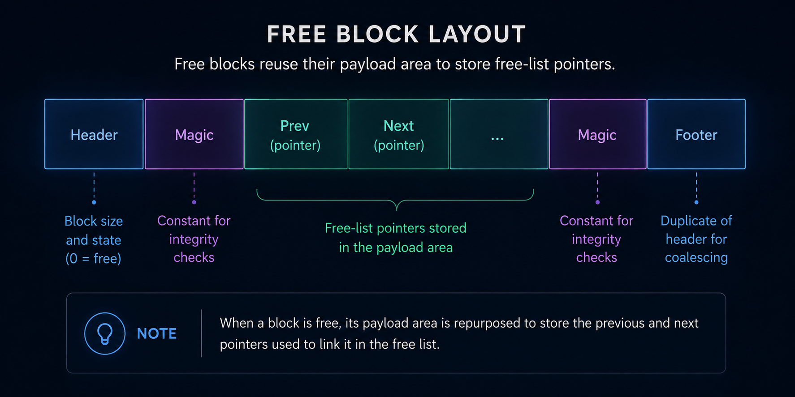
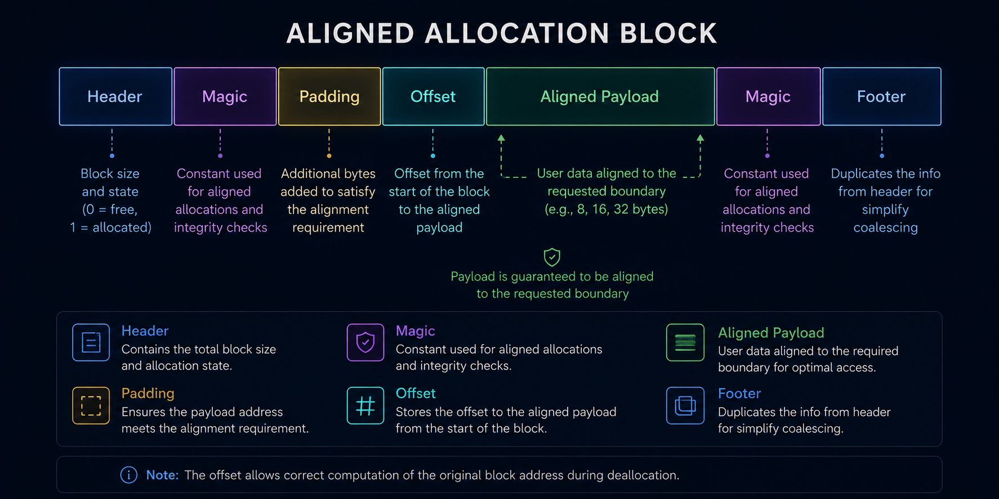

# DUX Small Allocator


Part of the DUX operating system project.

A custom memory allocator designed for operating system development.

The allocator combines several classic memory management techniques:

* Segregated free lists (256 bins)
* Boundary tags
* Dual magic markers
* Block splitting
* Block coalescing
* Aligned allocations

The implementation is designed to remain simple enough for educational and OS development purposes while still providing good allocation performance and low fragmentation.

---

## Overview



---

## Features

* O(1) bin lookup
* Boundary tags for fast coalescing
* 256 segregated bins
* Large block bin sorted by size
* Aligned allocation support
* Block splitting
* Block coalescing
* GoogleTest test suite
* Freestanding friendly
* Suitable for kernels, bootloaders and low-level runtime libraries

---

## Allocator Design

The allocator organizes free memory blocks into an array of 256 bins.

```cpp
MemBlock* gBins[256];
```

The bin index is computed directly from the block size:

```cpp
index = min(size, 255);
```

This provides constant-time access to the corresponding free-list.

### Small Bins

Bins `0..254` contain blocks of a specific size.

Insertion is performed at the front of the list.

### Large Bin

Bin `255` stores large blocks whose size is greater than or equal to 255 bytes.

Blocks in this bin are kept sorted by size.

This allows larger allocation requests to locate suitable blocks efficiently.

---

## Memory Layout

### Block



### Free Block

Free blocks reuse their payload area to store free-list pointers.



### Aligned Allocation Block



The offset value is stored immediately before the returned pointer and is used internally to recover the original allocation during deallocation.

The amount of padding depends on the requested alignment.

---

## Magic Values

Each block contains two sizeof(size_t)-bit magic values:

```text
Header | Magic | Payload | Magic | Footer
```

The allocator uses these values as part of its internal metadata validation during allocator operations.

---

## Boundary Tags

Each block contains both a header and a footer.

The header and footer store:

* block size
* allocation state

This allows neighbouring blocks to be located in constant time without maintaining a global list of all blocks.

### Why Boundary Tags?

Without coalescing:

```text
[A][F][A][F][A][F]
```

memory gradually becomes fragmented.

After coalescing:

```text
[A][      FREE      ][A]
```

larger allocations become possible again.

---

## Allocation Algorithm

Allocation proceeds as follows:

1. Compute the required block size.
2. Add allocator metadata overhead.
3. Select the appropriate bin.
4. Search for a suitable free block.
5. Split the block if necessary.
6. Mark the block as allocated.
7. Return the payload pointer.

---

## Deallocation Algorithm

Deallocation proceeds as follows:

1. Locate block metadata.
2. Mark the block as free.
3. Merge with the previous free block.
4. Merge with the next free block.
5. Insert the resulting block into the appropriate bin.

---

## Complexity

| Operation        | Complexity   |
| ---------------- | ------------ |
| mem_malloc()     | O(1) typical |
| mem_free()       | O(1)         |
| coalescing       | O(1)         |
| bin lookup       | O(1)         |
| large-bin search | O(n)         |

---

## Aligned Allocations

The allocator supports arbitrary power-of-two alignments.

```cpp
void* mem_malloc_aligned(size_t size,
                         size_t alignment);
```

Example:

```cpp
void* ptr = mem_malloc_aligned(4096, 64);

assert(reinterpret_cast<uintptr_t>(ptr) % 64 == 0);
```

Typical use cases:

* SIMD buffers
* DMA memory
* page-aligned structures
* kernel objects

---

## Testing

The allocator is covered by an extensive GoogleTest suite.

### Covered Scenarios

* allocator initialization
* malloc()
* free()
* calloc()
* realloc()
* aligned allocations
* alignment verification
* block splitting
* block coalescing
* repeated allocation/free cycles
* fragmentation recovery
* stress tests

### Stress Testing

The allocator is continuously tested using large allocation patterns including:

* sequential allocations
* alternating free patterns
* random allocation sizes
* realloc growth/shrink scenarios
* aligned allocation stress tests

---

## Build

### Library

```bash
mkdir build
cd build

cmake ../
cmake --build .
```

### Build with Tests

```bash
mkdir build
cd build

cmake ../ -DENABLE_TEST=1
cmake --build .
```

### Run Tests

```bash
./allocator_test
```

---

## Constants

| Constant           | Value    |
| ------------------ | -------- |
| Header Size        | 8 bytes  |
| Magic Size         | 8 bytes  |
| Footer Size        | 8 bytes  |
| Bin Count          | 256      |
| Large Bin Index    | 255      |
| Minimum Block Size | 32 bytes |

---

## Design Goals

The allocator was developed specifically for operating system projects and low-level software.

Primary goals:

* simplicity
* predictable behaviour
* low overhead
* fast allocation
* educational value

It is particularly well suited for:

* operating system kernels
* bootloaders
* embedded systems
* runtime libraries
* OS development projects

## SAST Tools

[PVS-Studio](https://pvs-studio.com/pvs-studio/?utm_source=website&utm_medium=github&utm_campaign=open_source) - static analyzer for C, C++, C#, and Java code.
